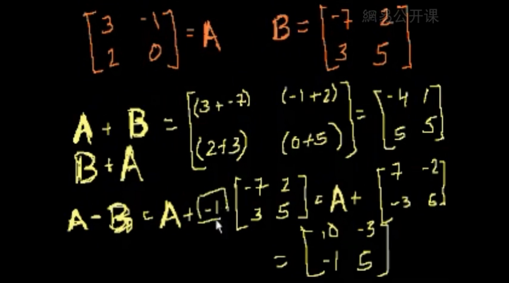
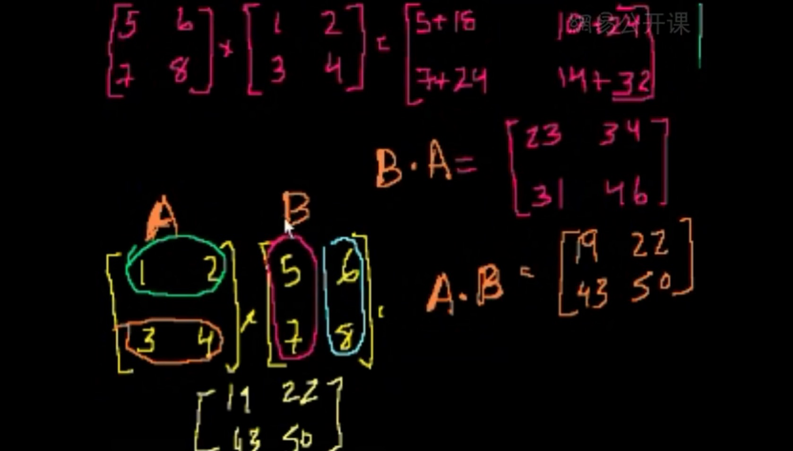
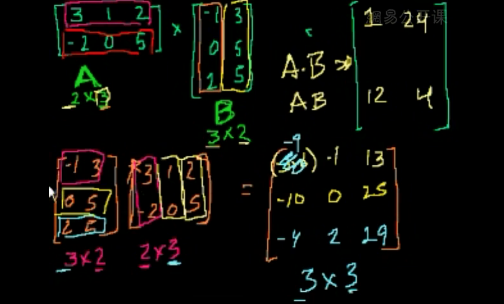
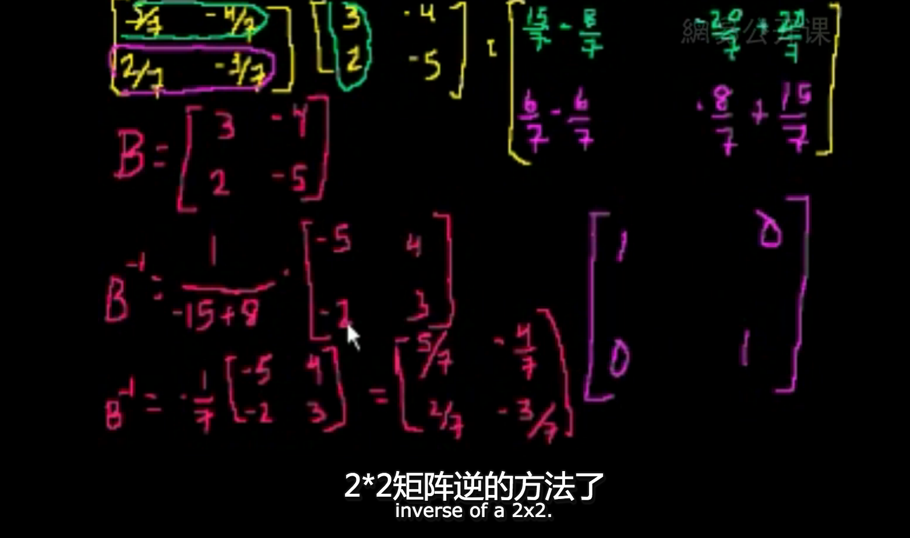
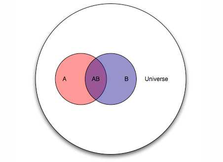

# GotoAI

**走向AI,Good good study,day day up!**

## 引导

## 数学基础教程

[可汗学院公开课：线性代数](http://open.163.com/special/Khan/linearalgebra.html)

[第1集] 矩阵简介 [在线观看](http://open.163.com/movie/2011/6/C/B/M82ICR1D9_M83C7VICB.html)

如果你已经看懂或还记得下面的图,略过视频



基本概念

* 矩阵(Matrix)
* 矩阵相加
* 矩阵相减

程序表示

```python
""" 矩阵例子 """
import numpy as np

matrix_a = np.mat('4 3; 2 1')
matrix_b = np.mat('1 2; 3 4')

print(matrix_a)
# [[4 3]
#  [2 1]]
print(matrix_b)
# [[1 2]
#  [3 4]]
print(matrix_a*matrix_b)
# [[13 20]
#  [ 5  8]]
print(matrix_a - matrix_b)

```

[第2集] 矩阵乘法(一) [视频](http://open.163.com/movie/2011/6/D/K/M82ICR1D9_M83C881DK.html)



代码

```python
print(matrix_a * matrix_b)
```

[第3集] 矩阵乘法(二) [视频](http://open.163.com/movie/2011/6/F/8/M82ICR1D9_M83C86FF8.html)



[第4集] 矩阵的逆(一) [视频](http://open.163.com/movie/2011/6/U/1/M82ICR1D9_M83C89FU1.html)



[第5集] 矩阵的逆(二) [视频](http://open.163.com/movie/2011/6/1/2/M82ICR1D9_M83C8JE12.html)

[第6集] 矩阵的逆(三)

[第7集] 矩阵法求解方程组

[第8集] 矩阵法求向量组合

[第9集] 奇异矩阵

[第10集] 三元线性方程

[第11集] 求解三元方程组

[第12集] 向量简介

[第13集] 向量范例

[第14集] 直线的参数表示

[第15集] 线性组合和向量张成的空间

[第16集] 关于线性无关

[第17集] 线性无关的进一步介绍

[第18集] 线性无关的相关例题

[第19集] 线性子空间

[第20集] 线性代数——子空间的基

[第21集] 向量的点积和模长

[第22集] 向量点积的性质及证明

[第23集] 不等式的证明

[第24集] 三角不等式

[第25集] 向量夹角的定义

[第26集] R3中由点与法向量定义的平面

[第27集] 外积

[第28集] 外积与夹角正弦值的关系

[第29集] 点积与外积的比较

[第30集] 矩阵行简化阶梯型1

[第31集] 矩阵行简化阶梯型2

[第32集] 矩阵行简化阶梯型3

[第33集] 矩阵向量积

[第34集] 零空间1-矩阵零空间介绍

[第35集] 零空间2-矩阵零空间计算

[第36集] 零空间3-零空间与线性无关的关系

[第37集] 矩阵的列空间

[第38集] 零空间与列空间

[第39集] 把列空间想象成三维空间上的平面

[第40集] 证明任意子空间基底数目相同

[第41集] 零空间的维数或零度

[第42集] 列空间的维数或秩

[第43集] 基底列和主列的关系

[第44集] 证明候选基底确实张成C(A)空间

[第45集] 函数的深入理解

[第46集] 向量变换

[第47集] 线性变换

[第48集] 矩阵向量乘法与线性变换

[第49集] 线性变换的矩阵向量乘积表示

[第50集] 子集在线性变换下的像

[第51集] 变换的像空间im(T)

[第52集] 集合的原像

[第53集] 原像和核的相关例子

[第54集] 线性变换的加法运算和数乘运算

[第55集] 矩阵加法和标量乘法详细论述

[第56集] 线性变换的例子——放缩和映射

[第57集] 在R2空间下利用2阶矩阵表示旋转变换

[第58集] 在R3空间内做旋转

[第59集] 单位向量

[第60集] 投影介绍

[第61集] 投影到直线的矩阵向量积表示

[第62集] 线性变换的复合1

[第63集] 线性变换的复合2

[第64集] 矩阵乘积范例

[第65集] 矩阵乘法结合律

[第66集] 矩阵乘法分配律

[第67集] 逆函数介绍

[第68集] 可逆性和f(x)=y解唯一性等价的证明

[第69集] 满射函数和单射函数

[第70集] 映上和一对一和可逆性的联系

[第71集] 一个变换是映上的判别方法

[第72集] 求Ax=b的解集

[第73集] 矩阵进行1-1变换的条件

[第74集] 关于可逆性的简化条件

[第75集] 证明逆矩阵是线性变换

[第76集] 寻求逆矩阵的求得方法

[第77集] 求逆矩阵举例

[第78集] 2×2矩阵的逆矩阵一般形式

[第79集] 3×3矩阵的行列式

[第80集] n×n矩阵的行列式

[第81集] 沿其他行或列求矩阵行列式

[第82集] 萨吕法则

[第83集] 当矩阵一行乘以系数时的行列式运算

[第84集] 关于行乘系数行列式的一点修正

[第85集] 当行相加时矩阵行列式的规律

[第86集] 有相同行的行列式

[第87集] 行变换后的行列式

[第88集] 上三角阵行列式

[第89集] 4×4行列式的简化

[第90集] 行列式与平行四边形面积

[第91集] 行列式作为面积因子

[第92集] 矩阵的转置

[第93集] 转置的行列式

[第94集] 矩阵乘积的转置

[第95集] 转置矩阵的加法与求逆运算

[第96集] 求向量的转置

[第97集] 行空间和左零空间

[第98集] 左零空间和行空间的可视化

[第99集] 正交补

[第100集] 矩阵A的秩等于A转置的秩

[第101集] dim(V)+dim(V正交补)=n

[第102集] 用子空间中的向量表示Rn中的向量

[第103集] 正交补空间的正交补空间

[第104集] 零空间的正交补

[第105集] 方程Ax=b的行空间中的解

[第106集] 方程Ax=b在行空间中的解的例子

[第107集] 证明(A转置)A是可逆的

[第108集] 子空间上的投影

[第109集] 平面上投影的可视化

[第110集] 子空间上的投影是线性变换

[第111集] 子空间投影矩阵的例子

[第112集] 关于投影的矩阵的另一个例子

[第113集] 投影是子空间中距离原向量最近的向量

[第114集] 最小二乘逼近

[第115集] 有关最小二乘的例子

[第116集] 另一个有关最小二乘的例子

[第117集] 向量在一组基下的坐标

[第118集] 基变换的矩阵

[第119集] 可逆基向量矩阵变换

[第120集] 对应一个基底的变换矩阵

[第121集] 一个替补基底变换矩阵的例子（1）

[第122集] 一个替补基底变换矩阵的例子（2）

[第123集] 改变坐标系有助于求出变换

[第124集] 标准正交基简介

[第125集] 标准正交基下的坐标

[第126集] 正交基下到子空间的投影

[第127集] 计算正交基下到子空间的投影矩阵

[第128集] 计算镜像变换矩阵

[第129集] 正交矩阵的保角性和保长性

[第130集] Schmidt过程

[第131集] Gram-Schmidt过程的例子

[第132集] Gram-Schmidt过程的另一个例子

[第133集] 特征向量和特征值的引入

[第134集] 特征值公式的证明

[第135集] 求解一个2×2矩阵的特征值的一个例子

[第136集] 求解特征向量和特征空间

[第137集] 求解3×3矩阵的特征值

[第138集] 求解3×3矩阵的特征向量和特征空间

[第139集] 说明特征基有利于构造合适的坐标

[第140集] 向量的三重积展开

[第141集] 由平面方程求法向量

[第142集] 点到平面的距离

[第143集] 平面之间的距离

[概率](http://open.163.com/special/Khan/probability.html)

[第1集] 基本概率

[第2集] 简单概率

[第3集] 扑克牌中的概率与文氏图

[第4集] 概率相加公式

[第5集] 独立事件的组合概率

[第6集] 几个概率习题

[第7集] 独立事件1

[第8集] 独立事件2

[第9集] 独立事件3

[第10集] 掷硬币的例子

[第11集] 得到至少一个正面

[第12集] 非均匀硬币的概率

[第13集] 相依事件的概率

[第14集] 相依事件的概率2

[第15集] 恰好得到两个正面

[第16集] 五次投掷得到三个正面

[第17集] 以二项式系数概括

[第18集] 概率1

[第19集] 概率2

[第20集] 概率3

[第21集] 概率4

[第22集] 概率5

[第23集] 概率6

[第24集] 事件与结果1

[第25集] 事件与结果2

[第26集] 事件与结果3

[第27集] 相依概率例子1

[第28集] 相依概率例子2

[第29集] 概率7

[第30集] 概率8

[第31集] 结果更复杂的概率

[第32集] 排列

[第33集] 组合

[第34集] 排列与组合1

[第35集] 排列与组合2

[第36集] 排列与组合3

[第37集] 排列与组合4

[第38集] 用组合求概率

[第39集] 排列与组合第二部分

[第40集] 超级百万大奖概率

[第41集] 条件概率与组合

[第42集] 生日概率问题

[第43集] 随机变量介绍

[第44集] 概率密度函数

[第45集] 二项分布1

[第46集] 二项分布2

[第47集] 二项分布3

[第48集] 二项分布4

[第49集] 期望值E(X)

[第50集] 二项分布的期望值

[第51集] 泊松分布1

[第52集] 泊松分布2

[第53集] 大数定律

[第54集] 人寿保险与死亡概率

[第55集] 勒布朗问连续投中10球的概率

[统计](http://open.163.com/special/Khan/khstatistics.html)

[微积分准备](http://open.163.com/special/Khan/precalculus.html)

[微分](http://open.163.com/special/Khan/differential.html)

[积分](http://open.163.com/movie/2017/5/K/0/MCIM9UCLC_MCIO21CK0.html)

## 常见算法

## 常见工具

## 实战

[机器学习实](https://github.com/apachecn/MachineLearning)

## 重点参考 

[MATRIX CAPSULES WITH EM ROUTING(使用 EM 路由的矩阵 capsule)](https://openreview.net/pdf?id=HJWLfGWRb)

https://openreview.net/pdf?id=HJWLfGWRb

https://www.toutiao.com/i6482558545681187341/

## 参考

### 国语

<https://github.com/MorvanZhou/tutorials>

<https://github.com/zlotus/notes-LSJU-machine-learning>

python

<https://pylint.readthedocs.io/en/latest/>

### deeplearning.ai
https://mooc.study.163.com/smartSpec/detail/1001319001.htm/?edusave=1&from=study

### tf * 4
https://www.toutiao.com/i6448800156446900750/?group_id=6448796272673669390&group_flags=0

[Neural Style](https://github.com/jcjohnson/neural-style)

https://github.com/cysmith/neural-style-tf

[Mozilla Deep Speech](https://github.com/mozilla/DeepSpeech)
百度DeepSpeech

文字分类 https://github.com/dennybritz/cnn-text-classification-tf

图片分类 https://github.com/akshaypai/tfClassifier

### 卷积层
一文了解各种卷积结构原理及优劣
https://www.toutiao.com/i6448048500524450317/?group_id=6448043969683128589&group_flags=0

https://medium.com/towards-data-science/types-of-convolutions-in-deep-learning-717013397f4d

更多卷积动画：
https://github.com/vdumoulin/conv_arithmetic


TheOrangeDuck Daniel Holden
我搭的神经网络不work该怎么办！看看这11条新手最容易犯的错误
https://www.toutiao.com/i6464389875142492685/?group_id=6464389875142492685&group_flags=0

一文看懂如何搭建AI应用：10周学会深度学习，还赢下5千美元
https://www.toutiao.com/i6383461061009342977/?group_id=6383458254790705410&group_flags=0

浅析Hinton最近提出的Capsule计划
https://zhuanlan.zhihu.com/p/29435406
sigmoid会饱和，造成梯度消失。于是有了ReLU。
ReLU负半轴是死区，造成梯度变0。于是有了LeakyReLU，PReLU。
强调梯度和权值分布的稳定性，由此有了ELU，以及较新的SELU。
太深了，梯度传不下去，于是有了highway。
干脆连highway的参数都不要，直接变残差，于是有了ResNet。
强行稳定参数的均值和方差，于是有了BatchNorm。
在梯度流中增加噪声，于是有了 Dropout。
RNN梯度不稳定，于是加几个通路和门控，于是有了LSTM。
LSTM简化一下，有了GRU。
GAN的JS散度有问题，会导致梯度消失或无效，于是有了WGAN。
WGAN对梯度的clip有问题，于是有了WGAN-GP。

Dynamic Routing Between Capsules

https://arxiv.org/abs/1710.09829

部分翻:https://www.toutiao.com/i6481644640318521870/

实现
https://github.com/naturomics/CapsNet-Tensorflow

2. 卷积神经网络了解博客。//blog.csdn.net/zouxy09/article/details/8781543

3. 卷积神经网络的推导博客。//blog.csdn.net/zouxy09/article/details/9993371/

【专栏】谷歌资深工程师深入浅析AlphaGo Zero与深度强化学习
http://m.hexun.com/hz/toutiao/2017-10-27/191404853.html?tt_group_id=6481477106782372110

人脸
https://www.toutiao.com/i6481423589345067534/
https://github.com/seetaface/SeetaFaceEngine

5行python运行神经元网络，动画给你演示，机器学习必备！  一个很简单的代码例子
https://www.toutiao.com/i6481039679838749198/

Deep neural networks for voice conversion (voice style transfer) in Tensorflow
https://github.com/andabi/deep-voice-conversion

Bottery is a syntax, editor, and simulator for prototyping generative contextual conversations modeled as finite state machines.
https://github.com/google/bottery

吴恩达

ReLU function rectified linear unit 修正线性单元
SNN standard NN neural network
CNN convolutional ..
Recurrent NN

正向传播步骤
反向传播步骤

logistic  regression 回归
Gradient Descent 梯度下降


[导数](https://zh.wikipedia.org/wiki/%E5%AF%BC%E6%95%B0#.E5.AF.BC.E6.95.B0.E7.9A.84.E8.AE.B0.E6.B3.95)

先验——根据若干年的统计（经验）或者气候（常识），某地方下雨的概率；
似然——下雨（果）的时候有乌云（因 or 证据 or 观察的数据）的概率，即已经有了果，对证据发生的可能性描述；
后验——根据天上有乌云（原因或者证据 or 观察数据），下雨（结果）的概率；

后验 ~ 先验*似然 ： 存在下雨的可能（先验），下雨之前会有乌云（似然）~ 通过现在有乌云推断下雨概率（后验）；




[贝叶斯推断如何更新后验概率？](https://www.zhihu.com/question/27398304)

这个给出的是程序员的视角:(nice)
[Gradient Descent 梯度下降法](https://ctmakro.github.io/site/on_learning/gd.html)
梯度下降法可以帮助我们找到某个函数的极小值或者最小值。

[机器学习中的数学(1)-回归(regression)、梯度下降(gradient descent)](http://www.cnblogs.com/LeftNotEasy/archive/2010/12/05/mathmatic_in_machine_learning_1_regression_and_gradient_descent.html)

[梯度下降（Gradient Descent）小结](https://www.cnblogs.com/pinard/p/5970503.html)