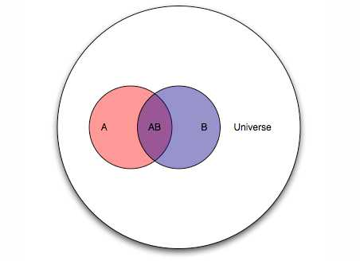
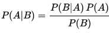

# 数学基础

## 概述

本章参考[<<转型AI｜非科班却拿下阿里云栖一等奖，他经历的坑足够你学100天>>](https://www.toutiao.com/i6488554603049648654/)

对三个基础数学概念进行详细描述

 1 懂得矩阵运算的基本计算方法，能够手动计算[3×4]×[4×3]的矩阵，并明白为什么会得到一个[3×3]的矩阵。

 2 懂得导数的基本含义，明白为什么可以利用导数来计算梯度，并实现迭代优化。

 3 能够计算基本的先验及后验概率。

## 矩阵

[笔记](./线性代数.md)

```python
""" 矩阵例子 """
import numpy as np

matrix_a = np.mat('4 3 2; 2 1 4; 1 2 3')
matrix_b = np.mat('1 2 3; 2 3 4; 3 4 1')

print(matrix_a)
[[4 3 2]
 [2 1 4]
 [1 2 3]]
print(matrix_b)
[[1 2 3]
 [2 3 4]
 [3 4 1]]
print(matrix_a * matrix_b)
[[16 25 26]
 [16 23 14]
 [14 20 14]]

print(matrix_a - matrix_b)

print(matrix_a + matrix_b)

```

## 导数及梯度下降算法

[导数](https://zh.wikipedia.org/wiki/%E5%AF%BC%E6%95%B0#.E5.AF.BC.E6.95.B0.E7.9A.84.E8.AE.B0.E6.B3.95)

这个给出的是程序员的视角:(nice)
[Gradient Descent 梯度下降法](https://ctmakro.github.io/site/on_learning/gd.html)
梯度下降法可以帮助我们找到某个函数的极小值或者最小值。

[机器学习中的数学(1)-回归(regression)、梯度下降(gradient descent)](http://www.cnblogs.com/LeftNotEasy/archive/2010/12/05/mathmatic_in_machine_learning_1_regression_and_gradient_descent.html)

[梯度下降（Gradient Descent）小结](https://www.cnblogs.com/pinard/p/5970503.html)

## 先验似然后验

  先验——根据若干年的统计（经验）或者气候（常识），某地方下雨的概率；
  似然——下雨（果）的时候有乌云（因 or 证据 or 观察的数据）的概率，即已经有了果，对证据发生的可能性描述；
  后验——根据天上有乌云（原因或者证据 or 观察数据），下雨（结果）的概率；
  后验 ~ 先验*似然 ： 存在下雨的可能（先验），下雨之前会有乌云（似然）~ 通过现在有乌云推断下雨概率（后验）；





[贝叶斯推断如何更新后验概率？](https://www.zhihu.com/question/27398304)


