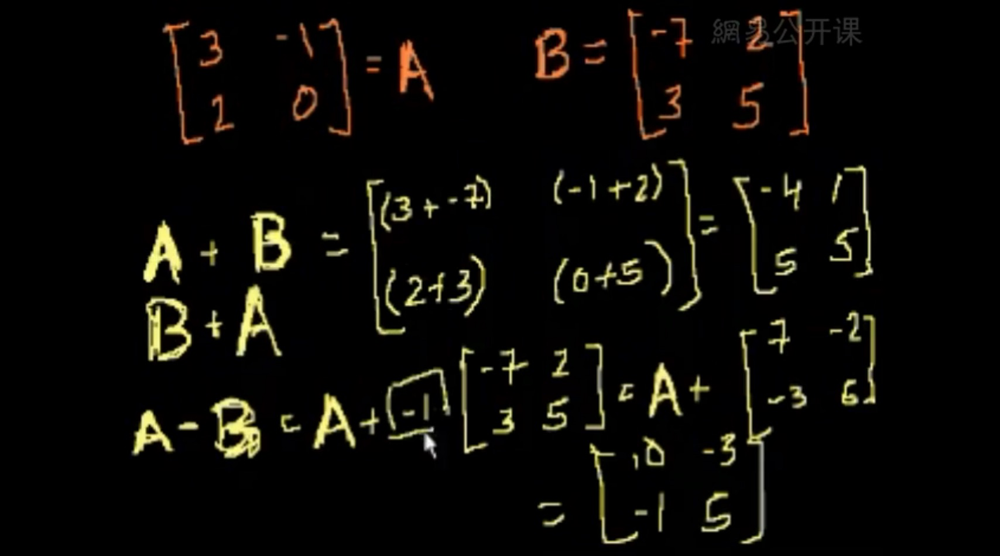
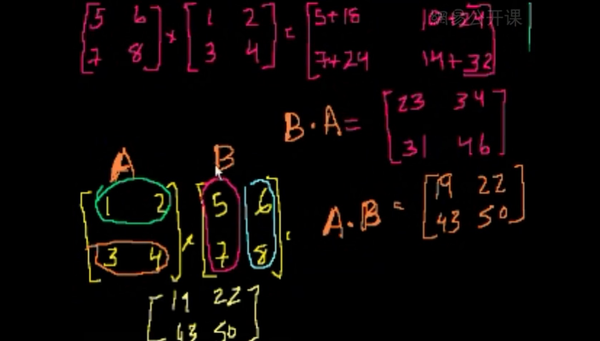
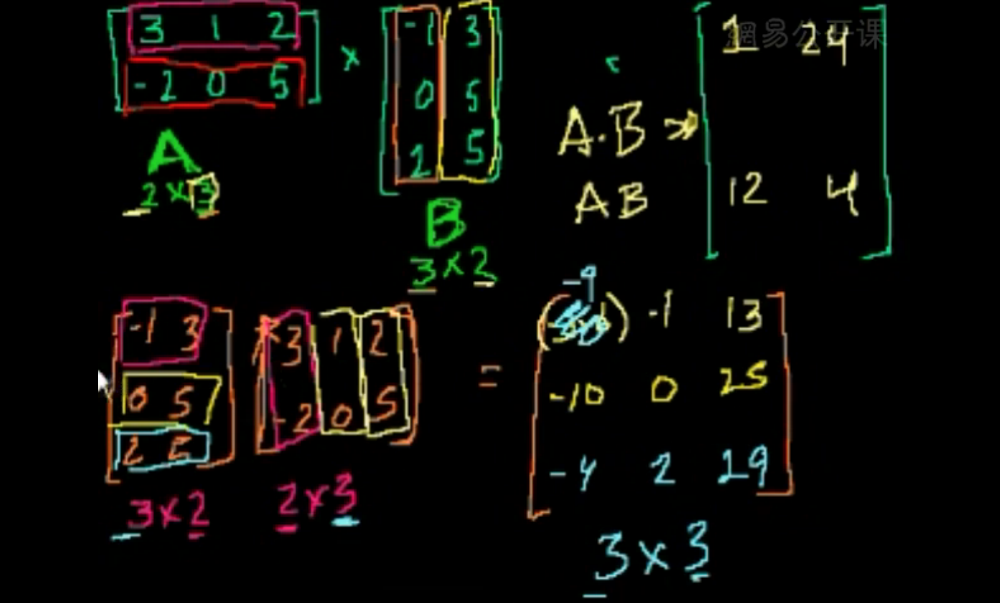
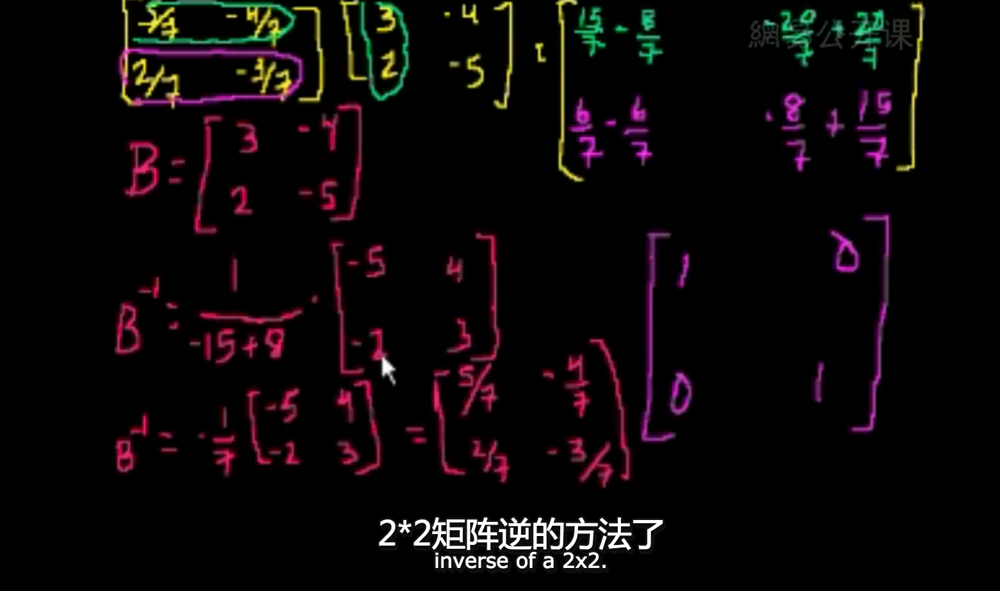

[第1集] 矩阵简介 [在线观看](http://open.163.com/movie/2011/6/C/B/M82ICR1D9_M83C7VICB.html)

如果你已经看懂或还记得下面的图,略过视频



基本概念

* 矩阵(Matrix)
* 矩阵相加
* 矩阵相减

程序表示

```python
""" 矩阵例子 """
import numpy as np

matrix_a = np.mat('4 3; 2 1')
matrix_b = np.mat('1 2; 3 4')

print(matrix_a)
# [[4 3]
#  [2 1]]
print(matrix_b)
# [[1 2]
#  [3 4]]
print(matrix_a*matrix_b)
# [[13 20]
#  [ 5  8]]
print(matrix_a - matrix_b)

```

[第2集] 矩阵乘法(一) [视频](http://open.163.com/movie/2011/6/D/K/M82ICR1D9_M83C881DK.html)



代码

```python
print(matrix_a * matrix_b)
```

[第3集] 矩阵乘法(二) [视频](http://open.163.com/movie/2011/6/F/8/M82ICR1D9_M83C86FF8.html)



[第4集] 矩阵的逆(一) [视频](http://open.163.com/movie/2011/6/U/1/M82ICR1D9_M83C89FU1.html)



[第5集] 矩阵的逆(二) [视频](http://open.163.com/movie/2011/6/1/2/M82ICR1D9_M83C8JE12.html)

[第6集] 矩阵的逆(三)

[第7集] 矩阵法求解方程组

[第8集] 矩阵法求向量组合

[第9集] 奇异矩阵

[第10集] 三元线性方程

[第11集] 求解三元方程组

[第12集] 向量简介

[第13集] 向量范例

[第14集] 直线的参数表示

[第15集] 线性组合和向量张成的空间

[第16集] 关于线性无关

[第17集] 线性无关的进一步介绍

[第18集] 线性无关的相关例题

[第19集] 线性子空间

[第20集] 线性代数——子空间的基

[第21集] 向量的点积和模长

[第22集] 向量点积的性质及证明

[第23集] 不等式的证明

[第24集] 三角不等式

[第25集] 向量夹角的定义

[第26集] R3中由点与法向量定义的平面

[第27集] 外积

[第28集] 外积与夹角正弦值的关系

[第29集] 点积与外积的比较

[第30集] 矩阵行简化阶梯型1

[第31集] 矩阵行简化阶梯型2

[第32集] 矩阵行简化阶梯型3

[第33集] 矩阵向量积

[第34集] 零空间1-矩阵零空间介绍

[第35集] 零空间2-矩阵零空间计算

[第36集] 零空间3-零空间与线性无关的关系

[第37集] 矩阵的列空间

[第38集] 零空间与列空间

[第39集] 把列空间想象成三维空间上的平面

[第40集] 证明任意子空间基底数目相同

[第41集] 零空间的维数或零度

[第42集] 列空间的维数或秩

[第43集] 基底列和主列的关系

[第44集] 证明候选基底确实张成C(A)空间

[第45集] 函数的深入理解

[第46集] 向量变换

[第47集] 线性变换

[第48集] 矩阵向量乘法与线性变换

[第49集] 线性变换的矩阵向量乘积表示

[第50集] 子集在线性变换下的像

[第51集] 变换的像空间im(T)

[第52集] 集合的原像

[第53集] 原像和核的相关例子

[第54集] 线性变换的加法运算和数乘运算

[第55集] 矩阵加法和标量乘法详细论述

[第56集] 线性变换的例子——放缩和映射

[第57集] 在R2空间下利用2阶矩阵表示旋转变换

[第58集] 在R3空间内做旋转

[第59集] 单位向量

[第60集] 投影介绍

[第61集] 投影到直线的矩阵向量积表示

[第62集] 线性变换的复合1

[第63集] 线性变换的复合2

[第64集] 矩阵乘积范例

[第65集] 矩阵乘法结合律

[第66集] 矩阵乘法分配律

[第67集] 逆函数介绍

[第68集] 可逆性和f(x)=y解唯一性等价的证明

[第69集] 满射函数和单射函数

[第70集] 映上和一对一和可逆性的联系

[第71集] 一个变换是映上的判别方法

[第72集] 求Ax=b的解集

[第73集] 矩阵进行1-1变换的条件

[第74集] 关于可逆性的简化条件

[第75集] 证明逆矩阵是线性变换

[第76集] 寻求逆矩阵的求得方法

[第77集] 求逆矩阵举例

[第78集] 2×2矩阵的逆矩阵一般形式

[第79集] 3×3矩阵的行列式

[第80集] n×n矩阵的行列式

[第81集] 沿其他行或列求矩阵行列式

[第82集] 萨吕法则

[第83集] 当矩阵一行乘以系数时的行列式运算

[第84集] 关于行乘系数行列式的一点修正

[第85集] 当行相加时矩阵行列式的规律

[第86集] 有相同行的行列式

[第87集] 行变换后的行列式

[第88集] 上三角阵行列式

[第89集] 4×4行列式的简化

[第90集] 行列式与平行四边形面积

[第91集] 行列式作为面积因子

[第92集] 矩阵的转置

[第93集] 转置的行列式

[第94集] 矩阵乘积的转置

[第95集] 转置矩阵的加法与求逆运算

[第96集] 求向量的转置

[第97集] 行空间和左零空间

[第98集] 左零空间和行空间的可视化

[第99集] 正交补

[第100集] 矩阵A的秩等于A转置的秩

[第101集] dim(V)+dim(V正交补)=n

[第102集] 用子空间中的向量表示Rn中的向量

[第103集] 正交补空间的正交补空间

[第104集] 零空间的正交补

[第105集] 方程Ax=b的行空间中的解

[第106集] 方程Ax=b在行空间中的解的例子

[第107集] 证明(A转置)A是可逆的

[第108集] 子空间上的投影

[第109集] 平面上投影的可视化

[第110集] 子空间上的投影是线性变换

[第111集] 子空间投影矩阵的例子

[第112集] 关于投影的矩阵的另一个例子

[第113集] 投影是子空间中距离原向量最近的向量

[第114集] 最小二乘逼近

[第115集] 有关最小二乘的例子

[第116集] 另一个有关最小二乘的例子

[第117集] 向量在一组基下的坐标

[第118集] 基变换的矩阵

[第119集] 可逆基向量矩阵变换

[第120集] 对应一个基底的变换矩阵

[第121集] 一个替补基底变换矩阵的例子（1）

[第122集] 一个替补基底变换矩阵的例子（2）

[第123集] 改变坐标系有助于求出变换

[第124集] 标准正交基简介

[第125集] 标准正交基下的坐标

[第126集] 正交基下到子空间的投影

[第127集] 计算正交基下到子空间的投影矩阵

[第128集] 计算镜像变换矩阵

[第129集] 正交矩阵的保角性和保长性

[第130集] Schmidt过程

[第131集] Gram-Schmidt过程的例子

[第132集] Gram-Schmidt过程的另一个例子

[第133集] 特征向量和特征值的引入

[第134集] 特征值公式的证明

[第135集] 求解一个2×2矩阵的特征值的一个例子

[第136集] 求解特征向量和特征空间

[第137集] 求解3×3矩阵的特征值

[第138集] 求解3×3矩阵的特征向量和特征空间

[第139集] 说明特征基有利于构造合适的坐标

[第140集] 向量的三重积展开

[第141集] 由平面方程求法向量

[第142集] 点到平面的距离

[第143集] 平面之间的距离